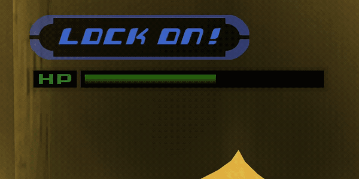

# Next Level Tracker

[GitHub Release](https://github.com/ROXASBrandon/KH1FM-Next-Level-Tracker/releases/latest) · [Report a bug](https://github.com/ROXASBrandon/KH1FM-Next-Level-Tracker/issues)

Keep your next level in sight! A small **NEXT LEVEL** label and remaining EXP appear below the upper-left Scan HP bar whenever Sora gains EXP. Press **F6** to check the counter without needing a fight.

## Features

- Minimal two-line popup using the game's native font and fading animation.
- Updates after EXP gains, with an **F6** preview during gameplay.
- Reads the current EXP table and Sora's leveling pace.
- Aligns with the left HUD, including the game's widescreen offset.
- Gives normal level-up notifications priority.
- Shows **MAX LEVEL** when Sora reaches level 100.
- Leaves EXP, stats, abilities, rewards, progression, and saves unchanged.

## Requirements

**Kingdom Hearts Final Mix**, Steam Global/WW **1.0.0.2**, **LuaBackend**, and **OpenKH Mods Manager** configured with **Panacea**. Epic Games and Steam JP are unsupported.

## Installation methods

Choose **one** method below. Close Kingdom Hearts normally before installing or updating, and keep only one copy of this mod enabled.

### OpenKH Mods Manager — GitHub

1. Open **OpenKH Mods Manager** and select **Kingdom Hearts 1**.
2. Open **Mods > Install new mods** or click **+**.
3. Enter `ROXASBrandon/KH1FM-Next-Level-Tracker` in the GitHub field.
4. Click **Install**, then enable **Next Level Tracker**.
5. Click **Mod Loader > Build and Run**.

### OpenKH Mods Manager — downloaded ZIP

1. Download **Next-Level-Tracker.zip** from [GitHub Releases](https://github.com/ROXASBrandon/KH1FM-Next-Level-Tracker/releases/latest).
2. Open **OpenKH Mods Manager** and select **Kingdom Hearts 1**.
3. Open **Mods > Install new mods** or click **+**.
4. Choose **Select and install Mod Archive or Lua Script**, then select the downloaded ZIP **without extracting it**.
5. Enable **Next Level Tracker**, then click **Mod Loader > Build and Run**.

Load gameplay, gain EXP, or tap **F6** to show the counter. The Lua script and compiled helper are included; no source compiler is needed to play.

### Updating

For a GitHub installation, close the game, use **Settings > Check Mods for Updates**, then rebuild and restart. For a ZIP installation, close the game, remove the previous imported copy, import the new ZIP, and rebuild. Remove the earlier **Next Level Popup** copy before switching to this release. Restart after updating; script reload alone cannot replace the native helper.

## Notes

Popup appears briefly after EXP gains rather than staying visible permanently. It is suppressed during detected pauses, cutscenes, loading, death, and Gummi gameplay. Normal level-up notices can delay it.

EXP updates and F6 were tested in gameplay. Build, EXP math, transitions, renderer arguments, and packaging passed automated checks. The final left-aligned layout and original font settings are shown in the gameplay clip above at 2560×1440. Other aspect ratios still need gameplay confirmation. Other HUD replacements are unverified.

## Removal

Close the game, disable this mod in OpenKH, rebuild, and restart.

## Source and credits

Build details are in [development notes](DEVELOPMENT.md). Thanks to **Sirius902 and LuaBackend contributors**, **gaithern and KH1-LUA-LIBRARY contributors**, and **Topaz** for the original native prompt technique. See [third-party notices](THIRD-PARTY-NOTICES.txt).

## My other mods

- [Keyblade Transmog](https://github.com/ROXASBrandon/KH1FM-Keyblade-Transmog) — cycle Keyblade appearances while keeping equipped stats and abilities.
- [Keyblade of Heart](https://github.com/ROXASBrandon/KH1FM-Keyblade-of-Heart) — Riku's Keyblade model, trail, and swing sounds over Kingdom Key.
- [Treasure Magnet Starter](https://github.com/ROXASBrandon/KH1FM-Treasure-Magnet-Starter) — early unlock, zero AP.
- [Treasure Magnet Vacuum](https://github.com/ROXASBrandon/KH1FM-Treasure-Magnet-Vacuum) — expanded pickup range for items and HP/MP/munny orbs.
